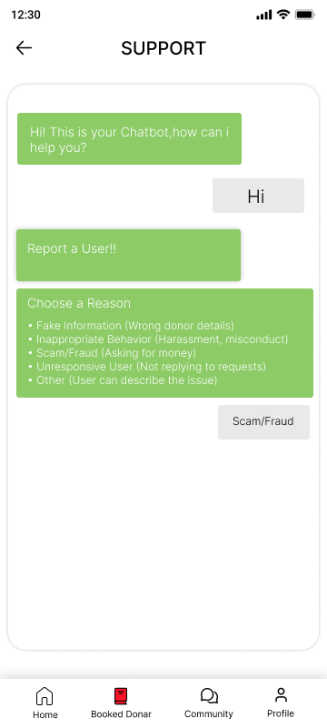
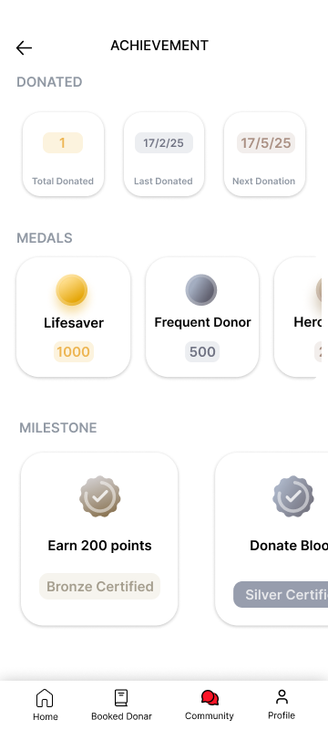

# Blood Donation Dynamic App

A comprehensive mobile application built with React Native and Expo to connect blood donors with those in need, manage blood banks, and foster a supportive blood donation community.

## Screenshots

### Main Screen


### Community Page


### Find Donor Page


### Blood Bank Details


### Available Donors


### Booked Donor


### Register as Donor


### Update Profile


### Support


### Other Options


### E-Certificate


### Achievement


## Tech Stack

- **Framework:** React Native with Expo
- **Navigation:** React Navigation
- **State Management:** Context API / Redux (if applicable)
- **Authentication:** Supabase Authentication
- **Database:** Supabase
- **OTP Verification:** Twilio
- **Storage:** Async Storage for local data caching
- **Mapping:** React Native Maps
- **UI Components:** Native Base / React Native Paper / Custom Components

## Features

- **Find Donors:** Users can search for blood donors based on blood group and location
- **Community Engagement:** Share and view upcoming blood donation events
- **Book Donors:** Option to book a donor for future use
- **Profile Management:** Users can maintain their profiles and donation history
- **Location-Based Services:** Integrated maps to locate nearby donors and donation centers
- **Push Notifications:** Alerts for urgent blood requirements and upcoming donation camps
- **OTP Verification:** Secure phone number verification using Twilio
- **Achievement System:** Track and display donation milestones
- **E-Certificates:** Digital certificates for blood donations
- **Support System:** In-app support and assistance

## Getting Started

### Prerequisites

Ensure you have the following installed:
- Node.js & npm
- Expo CLI
- Supabase project setup
- Twilio account (for OTP verification)

### Installation

1. Clone the repository:
   ```bash
   git clone https://github.com/your-repo/blood-donation-app.git
   cd blood-donation-app
   ```

2. Install dependencies:
   ```bash
   npm install
   ```

3. Set up environment variables:
   Create a `.env` file with the following variables:
   ```
   SUPABASE_URL=your_supabase_url
   SUPABASE_ANON_KEY=your_supabase_anon_key
   TWILIO_ACCOUNT_SID=your_twilio_account_sid
   TWILIO_AUTH_TOKEN=your_twilio_auth_token
   TWILIO_PHONE_NUMBER=your_twilio_phone_number
   ```

4. Start the application:
   ```bash
   npx expo start
   ```

You can run the app on:
- Android Emulator
- iOS Simulator
- Physical Device (via Expo Go)

### Reset the Project

If you need to reset the project to a fresh state:
```bash
npm run reset-project
```

## Learn More

- [Expo Documentation](https://docs.expo.dev/)
- [React Native Documentation](https://reactnative.dev/docs/getting-started)
- [Supabase Documentation](https://supabase.com/docs)
- [Twilio Documentation](https://www.twilio.com/docs)

## Join the Community

- [Expo on GitHub](https://github.com/expo/expo)
- [Discord Community](https://chat.expo.dev)
- [Supabase Community](https://supabase.com/community)

---

This project aims to make blood donation seamless and accessible for everyone. 🚑💉

## License

This project is licensed under the MIT License - see the LICENSE file for details.
